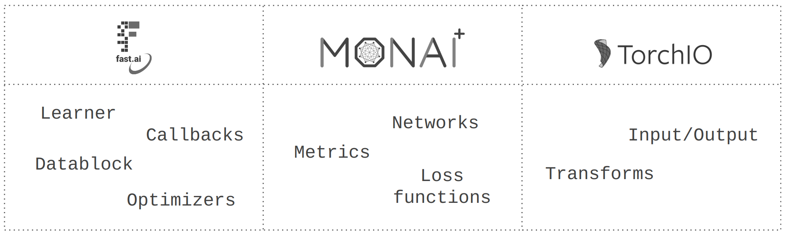

[](https://colab.research.google.com/github/MMIV-ML/fastMONAI/blob/master/paper/paper.ipynb)

# Summary

> _"Let us change our traditional attitude to the construction of programs: Instead of imagining that our main task is to instruct a computer what to do, let us concentrate rather on explaining to human beings what we want a computer to do."_[@donaldknuth]

In this work, we present <b>fastMONAI</b>, a low-code Python-based open source deep learning library built on top of fastai [@howard2020fastai; @howard2020deep], MONAI [@monai], and TorchIO [@perez2021torchio]. We created the library to simplify the use of state-of-the-art deep learning techniques in 3D medical image analysis for solving classification, regression, and segmentation tasks. fastMONAI provides users with functionalities to step through data loading, preprocessing, training, and result interpretations.

The paper is structured in the following way: it first states the need for the research, then showcases various applications and the library's user-friendliness, followed by a discussion about documentation, usability, and maintainability.

Note that this paper is automatically generated from a Jupyter Notebook available in the fastMONAI GitHub repo: [https://github.com/MMIV-ML/fastMONAI](https://github.com/MMIV-ML/fastMONAI). Using the notebook makes it possible to step through the paper's content and reproduce all the computations and results.

# Statement of need 

Deep learning develops at breakneck speed, with new models, techniques, and tricks constantly appearing. As a result, it is easy to get stuck on something less-than-optimal when using deep learning to solve a particular set of problems while also being in danger of getting lost in minor technical details when constructing models for concrete tasks. The fastai deep learning library [@howard2020fastai; @howard2020deep] provides both a high-level API that automatically incorporates many established best practices and a low-level API in which one can modify details related to model architectures, training strategies, data augmentation, and more. 

fastai is a general deep learning library built on top of PyTorch. Healthcare imaging has a variety of domain-specific demands, including medical imaging formats, data storage and transfer, data labeling procedures, domain-specific data augmentation, and evaluation methods. MONAI Core [@monai] and TorchIO [@perez2021torchio] target deep learning in healthcare imaging, incorporating multiple best practices. MONAI Core, the primary library of Project MONAI, is built on top of PyTorch and provides domain-specific functionalities for medical imaging, including network architectures, metrics, and loss functions. 
TorchIO is a Python-based open-source library for efficiently loading, preprocessing, and augmenting 3D medical images. 

A visual representation learning system is determined by three key factors: network architecture chosen, training methods, and data [@woo2023convnext]. Our combination of fastai, MONAI Core, and TorchIO into fastMONAI with custom modules like MedDataset makes it possible to easily construct, use and train powerful models for a range of medical imaging tasks, using all the best practices and domain-specific features incorporated into these three libraries. The library is developed at The Mohn Medical Imaging and Visualization Centre (MMIV), which is part of the Department of Radiology at Haukeland University Hospital. One of the center's key objectives is to develop new quantitative methods for high-field MRI, CT, and hybrid PET/CT/MR in preclinical and clinical settings, aiming to improve decision-making and patient care. fastMONAI supports such efforts by easing the entry for new practitioners into medical AI and making it possible to quickly construct good baseline models while still being flexible enough to enable further optimizations.


<br>
**Figure 1:** Overview of the components in fastMONAI and their connections to underlying libraries. 

# Using fastMONAI

In this section, we will explore how to use our library. In fastMONAI's online documentation (https://fastmonai.no/), multiple tutorials cover classification, regression, and segmentation tasks. 

## Classification

After installing the library, the first step is to import the necessary functions and classes. For example, the following line imports all of the functions and classes from the fastMONAI library: 


```python
from fastMONAI.vision_all import *
```

---
**NOTE**

It works with almost all markdown flavours (the below blank line matters).

---


# Acknowledgments

The Trond Mohn Research Foundation supported our work through the project _“Computational medical imaging and machine learning - methods, infrastructure and applications”_ at the Mohn Medical Imaging and Visualization Centre, grant number BFS2018TMT07, and a grant from the Western Norway Regional Health Authority (Helse Vest RHF), project F-12532.

# References
