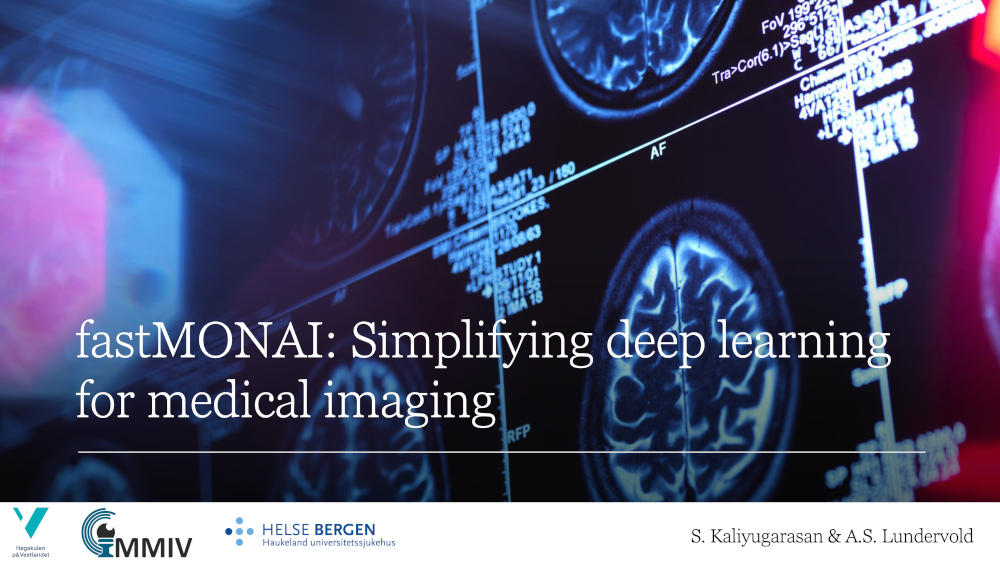

# MMIV Seminar, October 2022

 

_S. Kaliyugarasan & A.S. Lundervold, 2022_

Here you will find the material used in the MMIV seminar, October 21, 2022. 

  &nbsp;  &nbsp; 

## Table of contents 

### Slides

### Hands-on material

| Notebook    |      1-Click Notebook
|:----------|------|
|  [MMIV-Oct2022-brain_tumor_segmentation.ipynb](https://nbviewer.org/github/MMIV-ML/fastMONAI/blob/master/presentations/MMIV-1022/MMIV-Oct2022-brain_tumor_segmentation.ipynb)   Train your own deep learning model to segment brain tumors from multimodal MRI|  
