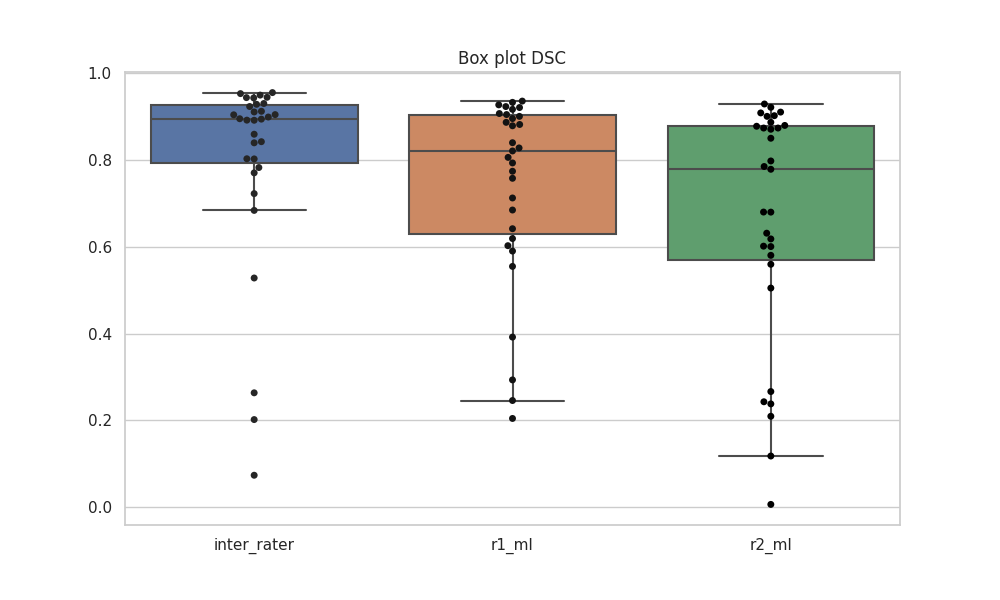
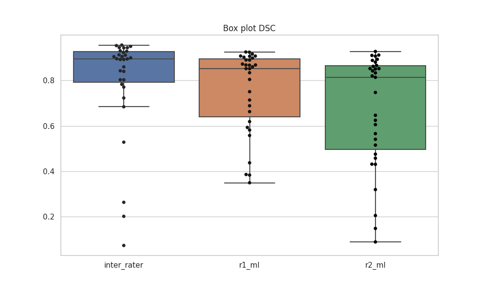

# Endometrial cancer segmentation
The primary objective of this repository is to reproduce the results reported in [Automated segmentation of endometrial cancer on MR images using deep learning](https://link.springer.com/content/pdf/10.1038/s41598-020-80068-9.pdf). In addition, we have looked at improving the segmentation performance using multi-sequence MR images (T2w, VIBE, and ADC) as reported in the study [Automatic segmentation of uterine endometrial cancer on multi-sequence MRI using a convolutional neural network](https://www.nature.com/articles/s41598-021-93792-7).

The trained weights and exported learner are available on [HugginFace](https://huggingface.co/skaliy/endometrial_cancer_segmentation). 

## How to use
1. Clone this repository.
2. Install fastMONAI by following the instructions provided [here](https://github.com/MMIV-ML/fastMONAI/tree/master).
3. (<b>Optional</b>) Run the `01_ec_training.ipynb` `03_ec_training-multi.ipynb` notebook to train your own model.
4. Run the 02-ec-inference.ipynb or inference_script.py to perform inference with the trained model for VIBE images.
5. Run the 04-ec-inference-multi.ipynb to perform inference with the trained model for T2w, VIBE, and ADC images.

If you choose to use `inference_script.py`, please follow these steps:

- Make the script executable using the following command in the terminal: `chmod +x inference_script.py`
- Run the script by executing the following command in the terminal: `python inference_script.py IMG_PATH`

## Results for VIBE
The box plot of the predictions on the validation set: 

The results from the validation set are also presented in the table below:

| subject_id | tumor_vol | inter_rater | r1_ml | r2_ml |
|---|---|---|---|---|
| 29 | 4.16 | 0.201835 | 0.806382 | 0.006231 |
| 32 | 8.00 | 0.684142 | 0.293306 | 0.209449 |
| 36 | 19.06 | 0.928750 | 0.793611 | 0.785335 |
| 47 | 11.01 | 0.944209 | 0.905159 | 0.902548 |
| 50 | 6.26 | 0.722867 | 0.619272 | 0.631579 |
| 65 | 13.09 | 0.930613 | 0.879279 | 0.850546 |
| 67 | 3.71 | 0.943498 | 0.887189 | 0.878163 |
| 75 | 7.16 | 0.263539 | 0.774411 | 0.266463 |
| 86 | 7.04 | 0.842577 | 0.821208 | 0.798148 |
| 135 | 8.10 | 0.839964 | 0.758176 | 0.680348 |
| 140 | 19.78 | 0.895506 | 0.936177 | 0.874019 |
| 164 | 16.98 | 0.905008 | 0.923559 | 0.887268 |
| 246 | 6.59 | 0.899448 | 0.907503 | 0.871254 |
| 255 | 36.22 | 0.955784 | 0.927517 | 0.921816 |
| 343 | 0.69 | 0.528261 | 0.840237 | 0.600751 |
| 349 | 2.96 | 0.912664 | 0.828181 | 0.778983 |
| 367 | 1.02 | 0.073485 | 0.392027 | 0.117796 |
| 370 | 10.82 | 0.953443 | 0.917094 | 0.908893 |
| 371 | 3.83 | 0.859781 | 0.685033 | 0.618380 |
| 375 | 11.67 | 0.911141 | 0.921345 | 0.910804 |
| 377 | 4.37 | 0.782994 | 0.712791 | 0.680165 |
| 381 | 7.63 | 0.891990 | 0.245768 | 0.237990 |
| 385 | 2.67 | 0.803215 | 0.641916 | 0.601690 |
| 395 | 0.68 | 0.770738 | 0.204418 | 0.242908 |
| 397 | 5.94 | 0.904544 | 0.882265 | 0.874036 |
| 409 | 11.86 | 0.944934 | 0.900965 | 0.901000 |
| 411 | 5.98 | 0.949977 | 0.933271 | 0.929499 |
| 425 | 0.91 | 0.802867 | 0.602796 | 0.559908 |
| 434 | 94.42 | 0.894601 | 0.590374 | 0.580553 |
| 531 | 22.08 | 0.892250 | 0.555015 | 0.505062 |
| 540 | 8.35 | 0.923702 | 0.895905 | 0.880058 |

<b>Median DSC</b>: 0.8946, 0.8212, 0.779

## Results for multi-sequence (T2, VIBE, and ADC)
The box plot of the predictions on the validation set: 

The results from the validation set are also presented in the table below:

Sure, here is your data without the index numbers, in Markdown table format:

| subject_id | tumor_vol | inter_rater | r1_ml | r2_ml |
|------------|-----------|-------------|-------|-------|
| 29 | 4.16 | 0.201835 | 0.859937 | 0.148586 |
| 32 | 8.00 | 0.684142 | 0.662912 | 0.515606 |
| 36 | 19.06 | 0.928750 | 0.903445 | 0.889360 |
| 47 | 11.01 | 0.944209 | 0.907479 | 0.907132 |
| 50 | 6.26 | 0.722867 | 0.587017 | 0.547842 |
| 65 | 13.09 | 0.930613 | 0.889782 | 0.862255 |
| 67 | 3.71 | 0.943498 | 0.872207 | 0.862281 |
| 75 | 7.16 | 0.263539 | 0.750735 | 0.205290 |
| 86 | 7.04 | 0.842577 | 0.872160 | 0.813740 |
| 135 | 8.10 | 0.839964 | 0.808324 | 0.751063 |
| 140 | 19.78 | 0.895506 | 0.907457 | 0.852548 |
| 164 | 16.98 | 0.905008 | 0.925958 | 0.893707 |
| 246 | 6.59 | 0.899448 | 0.906569 | 0.852195 |
| 255 | 36.22 | 0.955784 | 0.942831 | 0.945464 |
| 343 | 0.69 | 0.528261 | 0.875817 | 0.463243 |
| 349 | 2.96 | 0.912664 | 0.853302 | 0.821028 |
| 367 | 1.02 | 0.073485 | 0.391209 | 0.086412 |
| 370 | 10.82 | 0.953443 | 0.916154 | 0.911768 |
| 371 | 3.83 | 0.859781 | 0.665516 | 0.637862 |
| 375 | 11.67 | 0.911141 | 0.898501 | 0.910147 |
| 377 | 4.37 | 0.782994 | 0.714387 | 0.647229 |
| 381 | 7.63 | 0.891990 | 0.437500 | 0.430847 |
| 385 | 2.67 | 0.803215 | 0.688608 | 0.624595 |
| 395 | 0.68 | 0.770738 | 0.400970 | 0.444584 |
| 397 | 5.94 | 0.904544 | 0.868022 | 0.850653 |
| 409 | 11.86 | 0.944934 | 0.888056 | 0.885981 |
| 411 | 5.98 | 0.949977 | 0.884870 | 0.883174 |
| 425 | 0.91 | 0.802867 | 0.573756 | 0.490407 |
| 434 | 94.42 | 0.894601 | 0.618859 | 0.605528 |
| 531 | 22.08 | 0.892250 | 0.348378 | 0.318399 |
| 540 | 8.35 | 0.923702 | 0.894245 | 0.884275 |

<b>Median DSC</b>: 0.8946, 0.868, 0.8137

## Support and Contribution
For any issues related to the model or the source code, please open an issue in the corresponding GitHub repository. Contributions to the code or the model are welcome and should be proposed through a pull request.
