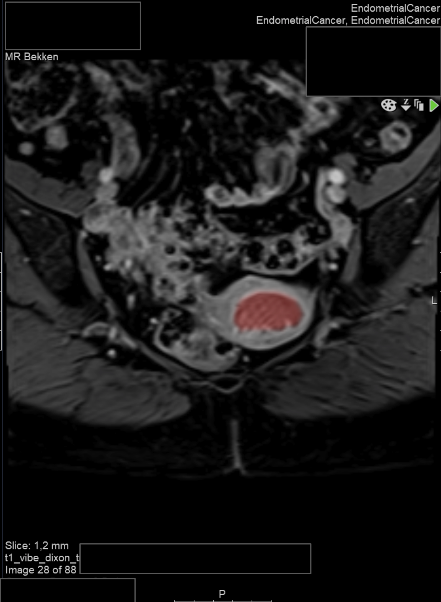

# Endometrial cancer segmentation
The primary objective of this repository is to reproduce the results reported in [Automated segmentation of endometrial cancer on MR images using deep learning](https://link.springer.com/content/pdf/10.1038/s41598-020-80068-9.pdf) and to integrate this model into research PACS. In addition, we have looked at improving the segmentation performance using multi-sequence MR images (T2w, VIBE, and ADC) as reported in the study [Automatic segmentation of uterine endometrial cancer on multi-sequence MRI using a convolutional neural network](https://www.nature.com/articles/s41598-021-93792-7).

The trained weights and exported learner are available on [Huggin Face](https://huggingface.co/skaliy/endometrial_cancer_segmentation). 
Test our model live with the Gradio app for VIBE on [Hugging Face Spaces](https://skaliy-endometrial-cancer-segmentation-app.hf.space). To run the application on your local system, follow the instructions in the [Getting started](#getting-started) section.

## Structure overview
```
├── figs
│
├── nbs            # Jupyter notebooks for training and inference
│   ├── 01_ec_training.ipynb
│   ├── 02_ec_inference.ipynb
│   ├── 03_ec_training_multi.ipynb
│   ├── 04_ec_inference_multi.ipynb
│
├── src                  
│   ├── app.py               # Gradio app
│   ├── inference_script.py     # Inference script for single-sequence 
│   └── inference_script_multi.py  # Inference for multi-sequence 
│
└── README.md
```        

## Getting started
1. Clone this repository:
```bash
git clone https://github.com/MMIV-ML/fastMONAI
```
2. Install fastMONAI by following the instructions provided [here](https://github.com/MMIV-ML/fastMONAI/tree/master).
3. (<b>Optional</b>) Run the `01_ec_training.ipynb` `03_ec_training_multi.ipynb` notebook to train your own model.
4. Run the `02_ec_inference.ipynb`, `inference_script.py` or `app.py` to perform inference with the trained model for VIBE images.
5. Run the `04_ec_inference_multi.ipynb` or `inference_script_multi.py` to perform inference with the trained model for T2w, VIBE, and ADC images.

If you choose to use `inference_script.py` or `inference_script_multi.py`, please follow these steps:

- Make the script executable using the following command in the terminal:
```bash
chmod +x inference_script.py
```
- Run the script by executing the following command in the terminal:
```bash
python inference_script.py IMG_PATH
```

If you choose to use `app.py`, please execute the following command in the terminal:
```bash
gradio app.py
```
The predicted maske will be stored in folder `ec_pred` in the `src` folder. 

## Results for VIBE
Note that our results are not directly comparable with the results reported in [study](https://link.springer.com/content/pdf/10.1038/s41598-020-80068-9.pdf), as we opted to use the test set for validation to allocate more data to training. Unlike the approach detailed in the study, we refrained from post-processing steps, such as retaining only the largest object. Predictions from new test cases indicate that this method could occasionally eliminate the tumor. Below is the box plot showcasing predictions on the validation set:


The results from the validation set are also presented in the table below:

|    |   subject_id |   tumor_vol |   inter_rater |    r1_ml |      r2_ml |   n_components |
|---:|-------------:|------------:|--------------:|---------:|-----------:|---------------:|
|  0 |           29 |        4.16 |     0.201835  | 0.806382 | 0.00623053 |              3 |
|  1 |           32 |        8    |     0.684142  | 0.293306 | 0.209449   |              4 |
|  2 |           36 |       19.06 |     0.92875   | 0.793055 | 0.784799   |              2 |
|  3 |           47 |       11.01 |     0.944209  | 0.900945 | 0.898409   |              2 |
|  4 |           50 |        6.26 |     0.722867  | 0.614357 | 0.624832   |              1 |
|  5 |           65 |       13.09 |     0.930613  | 0.879279 | 0.850546   |              2 |
|  6 |           67 |        3.71 |     0.943498  | 0.887189 | 0.878163   |              2 |
|  7 |           75 |        7.16 |     0.263539  | 0.774237 | 0.266619   |              2 |
|  8 |           86 |        7.04 |     0.842577  | 0.821208 | 0.798148   |              1 |
|  9 |          135 |        8.1  |     0.839964  | 0.758176 | 0.680348   |              2 |
| 10 |          140 |       19.78 |     0.895506  | 0.936177 | 0.874019   |              4 |
| 11 |          164 |       16.98 |     0.905008  | 0.923559 | 0.887268   |              1 |
| 12 |          246 |        6.59 |     0.899448  | 0.895311 | 0.860322   |              3 |
| 13 |          255 |       36.22 |     0.955784  | 0.927517 | 0.921816   |              6 |
| 14 |          343 |        0.69 |     0.528261  | 0.840237 | 0.600751   |              4 |
| 15 |          349 |        2.96 |     0.912664  | 0.828181 | 0.778983   |              1 |
| 16 |          367 |        1.02 |     0.0734848 | 0.391737 | 0.118035   |              1 |
| 17 |          370 |       10.82 |     0.953443  | 0.917094 | 0.908893   |              1 |
| 18 |          371 |        3.83 |     0.859781  | 0.684751 | 0.618114   |              1 |
| 19 |          375 |       11.67 |     0.911141  | 0.921079 | 0.91056    |              4 |
| 20 |          377 |        4.37 |     0.782994  | 0.712791 | 0.680165   |              1 |
| 21 |          381 |        7.63 |     0.89199   | 0.246428 | 0.238641   |              1 |
| 22 |          385 |        2.67 |     0.803215  | 0.641916 | 0.60169    |              1 |
| 23 |          395 |        0.68 |     0.770738  | 0.198273 | 0.236343   |              5 |
| 24 |          397 |        5.94 |     0.904544  | 0.882265 | 0.874036   |              3 |
| 25 |          409 |       11.86 |     0.944934  | 0.900727 | 0.900767   |              1 |
| 26 |          411 |        5.98 |     0.949977  | 0.933271 | 0.929499   |              1 |
| 27 |          425 |        0.91 |     0.802867  | 0.589069 | 0.545761   |              1 |
| 28 |          434 |       94.42 |     0.894601  | 0.590408 | 0.580585   |              1 |
| 29 |          531 |       22.08 |     0.89225   | 0.555066 | 0.505109   |              1 |
| 30 |          540 |        8.35 |     0.923702  | 0.855009 | 0.840958   |              1 |

<b>Median DSC</b>: 0.8946, 0.8212, 0.779

Prediction on a new subject in the research PACS: 


## Results for multi-sequence (T2, VIBE, and ADC)
The box plot of the predictions on the validation set: 


The results from the validation set are also presented in the table below:

|    |   subject_id |   tumor_vol |   inter_rater |    r1_ml |     r2_ml |   n_components |
|---:|-------------:|------------:|--------------:|---------:|----------:|---------------:|
|  0 |           29 |        4.16 |     0.201835  | 0.859937 | 0.148586  |              4 |
|  1 |           32 |        8    |     0.684142  | 0.662779 | 0.515479  |             10 |
|  2 |           36 |       19.06 |     0.92875   | 0.902343 | 0.888306  |              1 |
|  3 |           47 |       11.01 |     0.944209  | 0.907344 | 0.907     |              3 |
|  4 |           50 |        6.26 |     0.722867  | 0.581594 | 0.540991  |              5 |
|  5 |           65 |       13.09 |     0.930613  | 0.889782 | 0.862255  |              4 |
|  6 |           67 |        3.71 |     0.943498  | 0.851658 | 0.842331  |              2 |
|  7 |           75 |        7.16 |     0.263539  | 0.750551 | 0.205457  |              2 |
|  8 |           86 |        7.04 |     0.842577  | 0.87216  | 0.81374   |              1 |
|  9 |          135 |        8.1  |     0.839964  | 0.80436  | 0.747164  |              1 |
| 10 |          140 |       19.78 |     0.895506  | 0.907457 | 0.852548  |              1 |
| 11 |          164 |       16.98 |     0.905008  | 0.92533  | 0.893135  |              2 |
| 12 |          246 |        6.59 |     0.899448  | 0.906569 | 0.852195  |              5 |
| 13 |          255 |       36.22 |     0.955784  | 0.924517 | 0.927624  |              2 |
| 14 |          343 |        0.69 |     0.528261  | 0.868251 | 0.457711  |              3 |
| 15 |          349 |        2.96 |     0.912664  | 0.85214  | 0.819898  |              1 |
| 16 |          367 |        1.02 |     0.0734848 | 0.383455 | 0.0891463 |              3 |
| 17 |          370 |       10.82 |     0.953443  | 0.916154 | 0.911768  |              2 |
| 18 |          371 |        3.83 |     0.859781  | 0.593136 | 0.565848  |              8 |
| 19 |          375 |       11.67 |     0.911141  | 0.898501 | 0.910147  |              3 |
| 20 |          377 |        4.37 |     0.782994  | 0.713798 | 0.646684  |              3 |
| 21 |          381 |        7.63 |     0.89199   | 0.4375   | 0.430847  |              1 |
| 22 |          385 |        2.67 |     0.803215  | 0.688608 | 0.624595  |              1 |
| 23 |          395 |        0.68 |     0.770738  | 0.385992 | 0.43154   |              2 |
| 24 |          397 |        5.94 |     0.904544  | 0.868022 | 0.850653  |              6 |
| 25 |          409 |       11.86 |     0.944934  | 0.83407  | 0.833206  |              5 |
| 26 |          411 |        5.98 |     0.949977  | 0.867137 | 0.866112  |              1 |
| 27 |          425 |        0.91 |     0.802867  | 0.557732 | 0.475499  |              3 |
| 28 |          434 |       94.42 |     0.894601  | 0.618916 | 0.605596  |              6 |
| 29 |          531 |       22.08 |     0.89225   | 0.349648 | 0.319533  |              1 |
| 30 |          540 |        8.35 |     0.923702  | 0.890343 | 0.88052   |              1 |

<b>Median DSC</b>: 0.8946, 0.8521, 0.8137

## Support and Contribution
For any issues related to the model or the source code, please open an issue in the corresponding GitHub repository. Contributions to the code or the model are welcome and should be proposed through a pull request.
