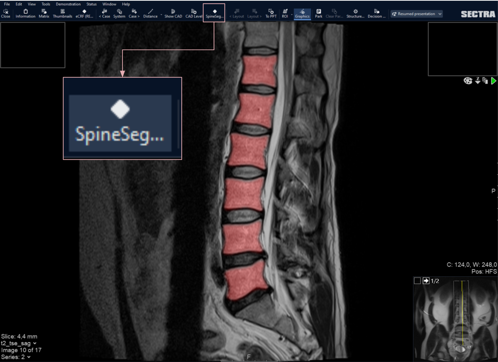

# Multi-Center CNN-based spine segmentation from T2w MRI using small amounts of data
The source code, designed to reproduce our test results and facilitate training and running inference on your own data. 
The trained weights and exported learners are available on [Huggin Face](https://huggingface.co/skaliy/spine-segmentation).

## Getting started
### Quick Start
Yyou can run the notebooks directly in Google Colab.

### Local Setup (Optional)
1. Clone this repository:
```bash
git clone https://github.com/MMIV-ML/fastMONAI
```
2. Install fastMONAI by following the instructions provided [here](https://github.com/MMIV-ML/fastMONAI/tree/master).
3. (<b>Optional</b>) Run the `00-spine-segmentation-training-evaluation.ipynb` notebook to train your own model or to reproduce the test results reported in our paper.
4. Run the `01-spine-segmentation-inference.ipynb` or `inference_script.py` to perform inference with the trained model on own data

If you choose to use `inference_script.py`
- Make the script executable using the following command in the terminal:
```bash
chmod +x inference_script.py
```
- Run the script by executing the following command in the terminal:
```bash
python inference_script.py IMG_PATH
```

## Research PACS 
Our spine segmentation application deployed in the research PACS system at our hospital: 

